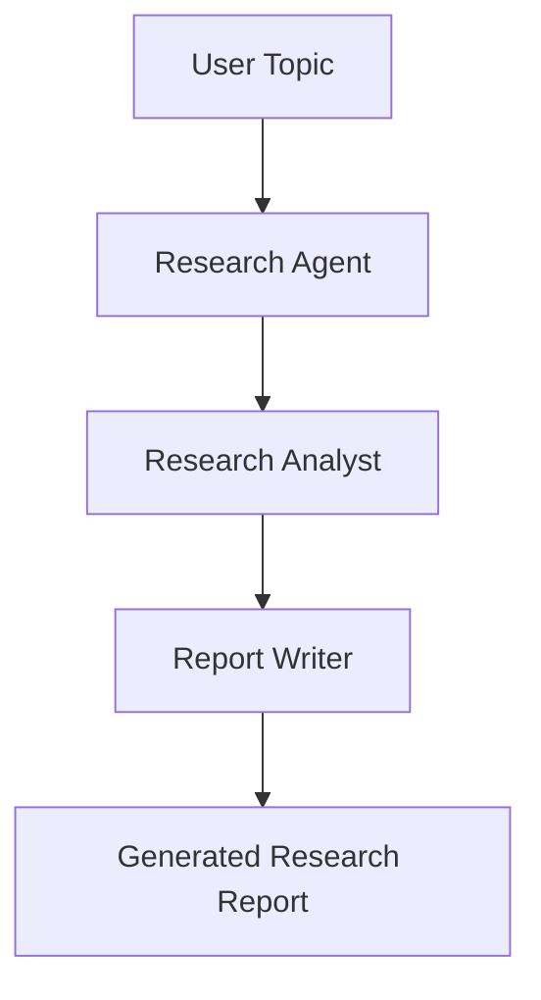

# AI Research Agent 🤖

An autonomous multi-agent AI research system built with CrewAI that researches any user-provided topic, analyzes the collected information, and generates a comprehensive report using a local Ollama LLM.

---

## Features ✨

- Multi-Agent AI Workflow
- Autonomous Research
- Web Search using Serper API
- Research Analysis
- Professional Report Generation
- Local LLM Support via Ollama
- Modular Architecture
- CrewAI Framework
- Markdown Report Export
- Easy Configuration using `.env`

---

## Tech Stack 🧰

- Python
- CrewAI
- CrewAI Tools
- Ollama
- Qwen2.5 / Llama3.2 (configurable)
- Serper API
- Python-dotenv

---

## Project Structure 📁

```text
AI-Research-Agent/
│
├── agents.py
├── tasks.py
├── tools.py
├── crew.py
├── run.py
├── .env.example
├── requirements.txt
├── README.md
├── .gitignore
│
├── scripts/
│   └── list_ollama_models.py
│
└── output/
    └── research_report.md
```

---

## How It Works ⚙️



The workflow is simple and fully automated:

1. You provide a topic.
2. The Research Agent searches the web and gathers useful information.
3. The Research Analyst organizes and refines the findings.
4. The Report Writer turns the analysis into a professional markdown report.
5. The final report is saved in `output/research_report.md`.

---

## Installation 🚀

### 1. Clone the repository

```bash
git clone https://github.com/your-username/ai-research-agent.git
cd ai-research-agent
```

### 2. Create a virtual environment

```bash
python -m venv .venv
```

Activate it on Windows:

```bash
.venv\Scripts\activate
```

### 3. Install requirements

```bash
pip install -r requirements.txt
```

### 4. Install Ollama

Download and install Ollama from:

```text
https://ollama.com
```

### 5. Pull a model

```bash
ollama pull qwen2.5:3b
```

You can also switch to another supported model such as `llama3.2` if preferred.

### 6. Configure `.env`

Copy the example file and update the values:

```bash
copy .env.example .env
```

### 7. Run the project

```bash
python run.py --topic "Artificial Intelligence"
```

---

## Environment Variables 🔐

| Variable | Description | Example |
| --- | --- | --- |
| `OLLAMA_BASE_URL` | Base URL for the local Ollama server | `http://localhost:11434` |
| `OLLAMA_MODEL` | Ollama model used by the agents | `qwen2.5:3b` |
| `SERPER_API_KEY` | API key for web search through Serper | `your_serper_api_key` |

---

## Usage 💡

Example command:

```bash
python run.py --topic "Artificial Intelligence"
```

Expected output:

```text
🚀 Starting AI Research Agent
✅ Research Completed
```

The full markdown report is generated in `output/research_report.md`.

---

## Example Topics 🌍

- AI Agents
- Machine Learning
- Quantum Computing
- Cybersecurity
- Healthcare AI
- Generative AI
- Computer Vision

---

## Future Improvements 🔮

- PDF Report Export
- Multi-LLM Support
- RAG Integration
- Memory
- Streamlit Dashboard
- React Frontend
- Vector Database
- Citation Support
- Multi-language Reports

---

## Skills Demonstrated 🧠

- Multi-Agent Systems
- AI Agents
- CrewAI
- Prompt Engineering
- Web Search
- Report Generation
- Autonomous AI
- Python
- LLM Integration
- Ollama
- Software Architecture

---

## License 📜

MIT License

---

## Author ✍️

**Name:** Yekkaluri Anirudh  
**LinkedIn:** https://www.linkedin.com/in/yekkaluri-anirudh-284183284/
